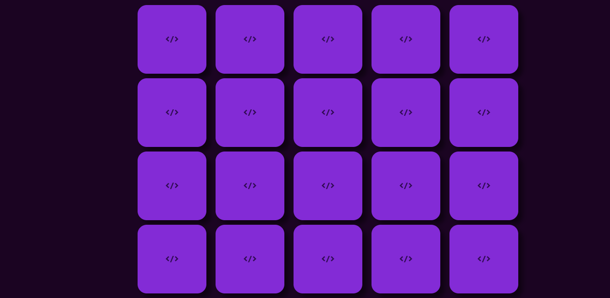

	
  

  

  

   Projeto desenvolvido no curso do ProgBR

   
 

  <a href="#clipboard-sobre-o-projeto">Sobre o Projeto</a>&nbsp;&nbsp;&nbsp;|&nbsp;&nbsp;&nbsp;
  <a href="#computer-tecnologias-utilizadas">Tecnologias</a>&nbsp;&nbsp;&nbsp;|&nbsp;&nbsp;&nbsp;
  <a href="#closed_book-licença">Licença</a>

## :clipboard: Sobre o Projeto

Projeto de construção de um jogo da memória que foi feito no curso programadorBR.  
Nesse projeto foi abordado vários conceitos de HTML, CSS e javaScript avançados. Para mais informações sobre o projeto estou a disposição. Não deixe de tentar completar o jogo da memoria ;). 

## :computer: Tecnologias utilizadas

  
  
  
  

Skills:

- HTML
- CSS
- JavaScript

## :closed_book: Licença

Esse projeto está sob a licença MIT. Veja o arquivo [LICENSE](https://github.com/JeffersonSilemen/jogoDaMemoria/blob/main/LICENSE) para mais detalhes.
